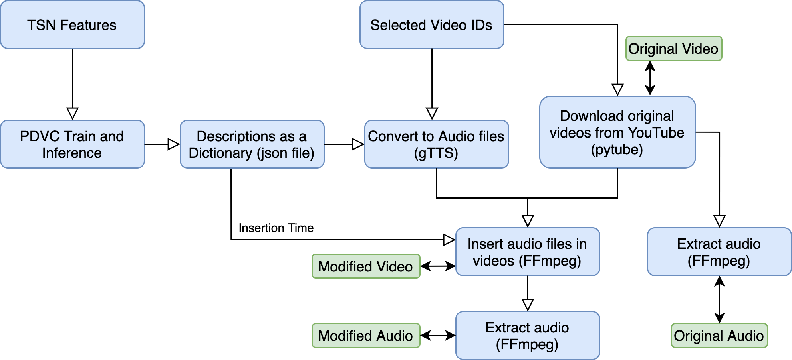

# Benchmark_DL_for_AD
Using a DL method to generate descriptions of scenes and evaluating it with a user study.

##Pipeline
1. [PDVC](https://github.com/ttengwang/PDVC) is used as the backbone model. The official implementation givens more directions on how to train the model and run inference to get the result dictionary used here (json files in the caption_json directory).
2. pytube is used to download a selected few videos from YouTube.
3. gTTS is used to convert the captions to audio files.
4. ffmpeg is used to insert the audio files into correct positions.
5. A user study is conducted with 70 participants to judge the applicability of this system as AD.

It is also shown in the following flow chart:

A representative set of analysis results is also in the figures directory.

##How to use this?
1. Get the captions in proper dictionary format.
2. Select the video set in [names.json](names.json) (video_ids key).
3. Run [main_data_gen.py](main_data_gen.py).
4. Get the user study data.
5. Run [data_analysis.py](data_analysis.py) to get the figures.
 
##Installation Requirements
1. Python requirements are in [requirements.txt](requirements.txt).
2. FFMpeg installation guidelines can be found on the [official site](https://www.ffmpeg.org/download.html) and [Home Brew Formula](https://formulae.brew.sh/formula/ffmpeg) for Mac Users.
